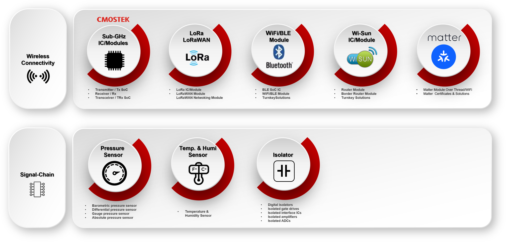

## Introduction
We would like to provide a quick introduction for customers who are new to HopeRF products, helping you set up your project quickly and move it into production.
HopeRF offers a wide range of products across different categories. Our wireless connectivity solutions include RF transmitters, receivers, transceivers, BLE SoCs, and WiFi/BLE modules. In the signal chain category, we provide pressure sensors, temperature and humidity sensors, and digital isolators.

    

  
    

## Product Catalog File Description
The **[HOPERF Product Catalog 202511.pdf](./HOPERF%20Product%20Catalog%20202511.pdf)** file in the root directory is the comprehensive official overview of HopeRF's full product range. It provides summaries, key features, and selection guidance for all product categories and is the recommended starting point for project planning before exploring detailed technical documents in individual folders.   

## Product
  * [SubG](./Sub-1GHz)
  * [LoRa / LoRaWAN](./LoRa)
  * [Isolator](./Isolator)
  * [Sensor](./Sensor)
  * [BLE](./BLE)
  * [2.4GHz](./2.4GHz)
  * [Matter](./Matter)
  * [Wi-Fi](./Wi-Fi)

## SDK Release
For the RFPDK, HopeDuino tools can be found in [Releases](https://github.com/HOPE-MICROELECTRONICS/Product_Portfolio/releases)